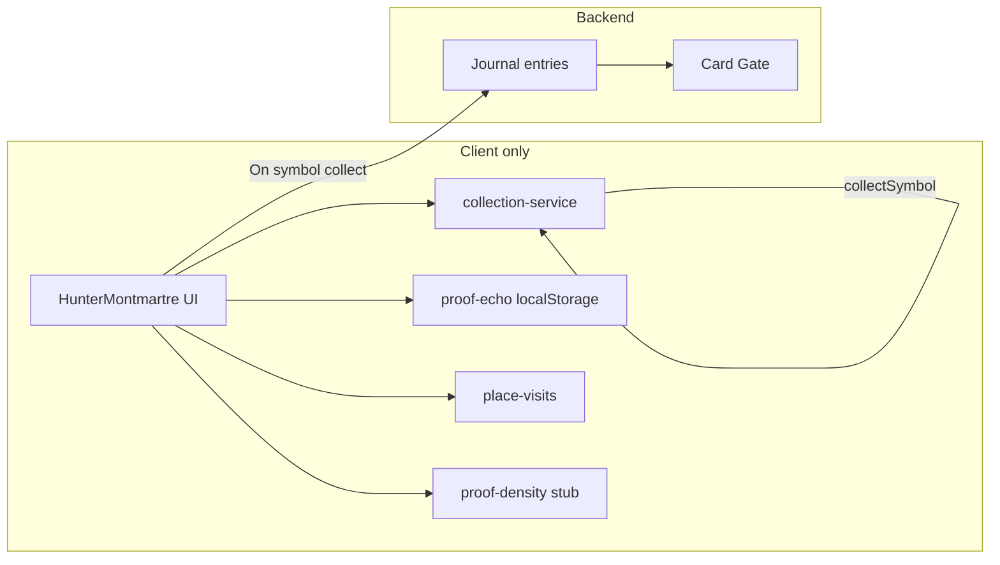

# Trésor Caché (Hunter: Montmartre) — Backend Architecture, Flow & Audit

Context for refining direction: what is backend vs frontend state, what is under-exploited, and where you might change direction.

---

## 1. Page identity

- **Entry:** Homepage → "Trésor Caché" / "Hidden Treasure" → `navigateTo('detail', 'hunter-montmartre')`.
- **Route:** Same as a quête detail: `#quete/hunter-montmartre`; App renders `HunterMontmartre` when `selectedQueteId === 'hunter-montmartre'`.
- **Main file:** [src/components/HunterMontmartre.tsx](src/components/HunterMontmartre.tsx) (~1437 lines).
- **Supporting:** [src/data/artifacts.ts](src/data/artifacts.ts) (Compass artifacts), [src/utils/compass-constants.ts](src/utils/compass-constants.ts), [src/utils/geo.ts](src/utils/geo.ts), [src/utils/proof-echo.ts](src/utils/proof-echo.ts), [src/utils/proof-density.ts](src/utils/proof-density.ts), [src/utils/place-visits.ts](src/utils/place-visits.ts), [src/utils/nocturne.ts](src/utils/nocturne.ts). Locales: [src/locales/{fr,en}/treasure.json](src/locales/fr/treasure.json).

---

## 2. Backend vs frontend state (summary)

### 2.1 What actually hits the backend

| Touchpoint | When | Backend |
|------------|------|---------|
| **Journal (Carnet)** | When a symbol is **collected** (GPS success or proof answer correct) | Card Gate `POST /journal/entries` via [journal-sync.syncCollectionToJournal](src/utils/journal-sync.ts) → [card-gate-client.appendJournalEntry](src/utils/card-gate-client.ts). Writes a line like "Collected: &lt;symbol name&gt;" so it appears in Carnet. |
| **Proof submission** | User taps "Open email" in Compass proof modal | **No backend.** Opens `mailto:proof@arche.paris` with subject/body. A **local-only** log is written to `localStorage` (`arche_proof_requests_v1`) with `artifactId`, `at`, `cardIdShort`. No server receives the proof in the current flow. |

So: the only server-side effect of Trésor Caché today is **journal entries when a symbol is collected**. Progress, riddles, proof sending, and "city echo" are **not** backed by a dedicated Trésor Caché API.

### 2.2 Frontend / local state (source of truth)

| Concern | Where | Notes |
|--------|--------|--------|
| **Which symbols are collected** | [collection-service](src/utils/collection-service.ts) (localStorage `arche_collection`) | `isSymbolCollected(symbolId)`, `collectSymbol(symbolId)`. Drives "X/4 symboles trouvés" and which symbol is "current". |
| **Hunt phase & UI** | React state in HunterMontmartre | `phase`: intro → riddle → hunting → gps_check / proof → success → complete. Plus riddle/proof answers, timers, cooldown, map toggle, GPS status. |
| **Riddle answers & proof answers** | Hardcoded in HunterMontmartre ([SYMBOL_TECHNICAL](src/components/HunterMontmartre.tsx)) + locale `treasure.symbols` | Riddle and proof validated in the client only. No server round-trip. |
| **Symbol copy (riddle, clue, proof Q)** | Locale JSON `treasure.symbols` | FR/EN; technical data (coordinates, answers) in SYMBOL_TECHNICAL. |
| **Compass: proof requests & echo** | [proof-echo](src/utils/proof-echo.ts) (localStorage) | Logs "proof sent" (artifact + timestamp). "Echo" = after 24–48h, idempotent flag so a Carnet line can be added later (appendEchoToJournal). All logic is client-side. |
| **Compass: "density" (few/many)** | [proof-density](src/utils/proof-density.ts) | **Stub:** `STUB_NO_BACKEND = true` → always returns `'none'`. Comment mentions future `GET /api/density?artifact=...`. |
| **Place visits (return prompts)** | [place-visits](src/utils/place-visits.ts) (localStorage) | Last visit + season per artifact; used for "What has changed since you were last here?" etc. No server. |
| **Compass artifact list** | [artifacts.ts](src/data/artifacts.ts) | Static: Saint-Sulpice, Passe-Muraille, Point Zéro nocturne. No backend fetch. |

---

## 3. Flow (end-to-end)

### 3.1 Hunt flow (Montmartre 4 symbols)

1. **Entry** — User opens Trésor Caché; first uncollected symbol index is derived from `isSymbolCollected` (collection-service). Phase = `intro` or `complete` if all collected.
2. **Intro** — Current symbol name + "solve riddle to reveal clue". Optional map toggle (Paris SVG, same asset as Mon Paris).
3. **Riddle** — User starts riddle → 30s timer. User submits answer; checked client-side against `SYMBOL_TECHNICAL[symbolId].riddleAnswer`. Correct → `hunting`; wrong → error + 60s cooldown, back to intro.
4. **Hunting** — Clue text + "Je l'ai trouvé" → either:
   - **GPS path:** `tryGpsVerification()` → getCurrentPosition → distance to symbol coords. If ≤ 100 m → collect symbol, `syncCollectionToJournal`, phase `success`. If not → fallback to proof question.
   - **Proof path:** User answers proof question; checked against `SYMBOL_TECHNICAL[symbolId].proofAnswers`. Correct → collect, sync to journal, `success`.
5. **Success** — "Ajouté à ta collection" → next symbol or finish.
6. **Complete** — "Gardien de Montmartre" + list of collected symbols + "Retour à l'accueil".

**Backend in this flow:** Only at step 4 when a symbol is collected: `collectSymbol()` (local) + `syncCollectionToJournal()` → Card Gate journal.

### 3.2 Compass flow (proof-by-email, no location stored)

1. User enables Compass → geolocation watch; nearest artifact (from ARTIFACTS), distance, bearing, pressure zone (far/warm/hot/near) from [compass-constants](src/utils/compass-constants.ts). Nocturne mode hides non-nocturne artifacts.
2. "Send proof" when in proof range (≤ 18 m) → proof modal → "Open email" → mailto to proof@arche.paris; localStorage log updated; `recordPlaceVisit(artifact.id)`; "Inscribed" confirmation ("La ville fera écho dans quelques heures").
3. Echo: proof-echo runs on a timer/check; 24–48h after a request, can call `appendEchoToJournal` and mark echoed (local). No server "echo" API.

**Backend in this flow:** None for proof. Echo is client-driven journal append via Card Gate when the delay has passed.

### 3.3 Data flow diagram (high level)

---

## 4. Under-exploited (audit)

Use this to decide what to refine and whether to change backend vs frontend.

1. **Proof has no backend**  
   Proofs go by email; only a local log exists. You cannot:
   - Validate or attribute proofs server-side.
   - Run "city echo" or any delayed response from the server.
   - Show real "density" (few/many) from proof counts.  
   **Direction:** Either keep it as a human-in-the-loop ritual (no backend) or add a minimal "proof submission" API (e.g. upload token or idempotent proof event) and optionally an echo/density backend later.

2. **Proof density is stubbed**  
   [proof-density](src/utils/proof-density.ts) always returns `'none'`. Copy ("Peu ont trouvé ce lieu" / "D'autres se sont tenus ici") is never shown with real data.  
   **Direction:** Backend endpoint that returns density per artifact (e.g. anonymous count buckets) and wire it here; or remove/simplify the UI if you want to stay backend-free.

3. **Progress is device-local**  
   Collection is in localStorage. Clearing data or switching device loses "X/4 symboles". Same for Compass proof log and place visits.  
   **Direction:** If "Trésor Caché progress" should survive device change, add a backend model (e.g. collected symbols + optional proof events) and sync via Card Gate (or existing auth).

4. **Riddle/proof answers are in the client**  
   Answers are in SYMBOL_TECHNICAL and locale. Anyone can read them; no anti-cheat.  
   **Direction:** Accept as intentional (ritual, not security) or move validation to the server and only send "correct/incorrect" to the client (more work, changes flow).

5. **Compass and Hunt are only loosely connected**  
   Compass uses ARTIFACTS (Saint-Sulpice, Passe-Muraille, Point Zéro); Hunt uses Montmartre-only symbols (sym-18-*). One artifact (montmartre-passe-muraille) links to hunter-montmartre. "See the linked walk" is the main bridge.  
   **Direction:** If you want "one Trésor Caché world", consider a unified artifact/symbol model and maybe one progress API for both Hunt and Compass.

6. **Journal is the only cross-feature trace**  
   Carnet shows "Collected: …" and later echo lines. No dedicated "Trésor Caché" or "Compass" section in the backend.  
   **Direction:** Fine if you want everything as "journal"; if you want analytics or product logic per feature, consider a small backend model (e.g. events or progress) in addition to journal.

7. **No motion tokens**  
   HunterMontmartre uses ad-hoc timeouts (e.g. 1500 ms, 2000 ms) and no shared motion language.  
   **Direction:** Align with [motion.ts](src/design/motion.ts) for consistency with Mon Paris / Instruments.

8. **Hardcoded constants**  
   RIDDLE_TIME (30s), COOLDOWN_TIME (60s), GPS_RADIUS_METERS (100), pressure thresholds in compass-constants.  
   **Direction:** If you want to tune or A/B test, move to config or backend-driven constants.

---

## 5. Questions to refine direction

- **Progress:** Should "X/4 symboles" and Compass proof state live only on the device, or be synced (e.g. Card Gate) so they persist across devices?
- **Proof:** Keep proof as "email + local log" only, or add a minimal proof API (e.g. submit proof event, no file) so the server can drive echo/density later?
- **Density:** Do you want real "few/many" from the backend, or drop/simplify that copy?
- **Scope:** Is Trésor Caché meant to stay "Montmartre + Compass artifacts" with local state, or become a first-class product surface with its own backend (progress, proofs, density)?
- **Front-end consistency:** Do you want HunterMontmartre to use the same motion tokens and design constraints as Mon Paris / Instruments (e.g. no raw timeouts, same easing)?

---

## 6. File map (quick reference)

| Role | Path |
|------|------|
| Main screen | [src/components/HunterMontmartre.tsx](src/components/HunterMontmartre.tsx) |
| Compass artifacts | [src/data/artifacts.ts](src/data/artifacts.ts) |
| Compass thresholds | [src/utils/compass-constants.ts](src/utils/compass-constants.ts) |
| Geo (distance, bearing) | [src/utils/geo.ts](src/utils/geo.ts) |
| Proof log & echo | [src/utils/proof-echo.ts](src/utils/proof-echo.ts) |
| Proof density (stub) | [src/utils/proof-density.ts](src/utils/proof-density.ts) |
| Place visits (return) | [src/utils/place-visits.ts](src/utils/place-visits.ts) |
| Collection (symbols) | [src/utils/collection-service.ts](src/utils/collection-service.ts) |
| Journal sync on collect | [src/utils/journal-sync.ts](src/utils/journal-sync.ts), [src/utils/card-gate-client.ts](src/utils/card-gate-client.ts) |
| Locales | [src/locales/{fr,en}/treasure.json](src/locales/fr/treasure.json) |
| App routing | [src/App.tsx](src/App.tsx) (detail → hunter-montmartre) |
